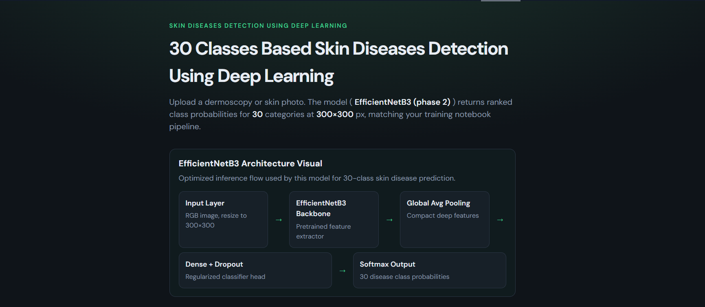

<div align="center">

# 🔬 Skin Disease Detection Using Deep Learning

<style>
  @keyframes fadeInDown {
    from { opacity: 0; transform: translateY(-20px); }
    to { opacity: 1; transform: translateY(0); }
  }
  
  @keyframes slideInRight {
    from { opacity: 0; transform: translateX(-20px); }
    to { opacity: 1; transform: translateX(0); }
  }
  
  @keyframes pulse {
    0%, 100% { opacity: 1; }
    50% { opacity: 0.7; }
  }
  
  @keyframes shimmer {
    0% { background-position: -1000px 0; }
    100% { background-position: 1000px 0; }
  }
  
  .badge-animate {
    animation: slideInRight 0.6s ease-out;
    display: inline-block;
    margin: 5px;
  }
  
  .hero-text {
    animation: fadeInDown 0.8s ease-out;
    background: linear-gradient(135deg, #667eea 0%, #764ba2 100%);
    -webkit-background-clip: text;
    -webkit-text-fill-color: transparent;
    font-weight: bold;
  }
  
  .feature-card {
    animation: slideInRight 0.8s ease-out;
    padding: 15px;
    border-left: 4px solid #667eea;
    margin: 10px 0;
    transition: all 0.3s ease;
  }
  
  .feature-card:hover {
    transform: translateX(5px);
    background: rgba(102, 126, 234, 0.1);
    border-left-color: #764ba2;
  }
</style>

**AI-powered skin disease classification with interactive prediction & recommendations**

[](http://127.0.0.1:5000)
[](./Models/effBb3/)
[](./LICENSE)

</div>

---

## FrontEnd of Project



## ✨ Key Features

<div class="feature-card">
  ✅ <strong>30-Class Deep Learning Model</strong><br/>
  TensorFlow/Keras model trained with EfficientNetB3 architecture
</div>

<div class="feature-card">
  ✅ <strong>Real-time Camera Capture</strong><br/>
  Direct browser integration for instant disease detection
</div>

<div class="feature-card">
  ✅ <strong>Image Upload Support</strong><br/>
  Upload from desktop or mobile device
</div>

<div class="feature-card">
  ✅ <strong>Medical Recommendations</strong><br/>
  AI-powered clinical guidance and specialist suggestions
</div>

<div class="feature-card">
  ✅ <strong>Interactive Explorer</strong><br/>
  Search and explore all 30 disease classes with detailed info
</div>

---

## 📚 Quick Navigation

| Section            | Link                                      |
| ------------------ | ----------------------------------------- |
| 🔍 Overview        | [View Details](#overview)                 |
| 🌐 Web Interface   | [Features & Stack](#flask-web-app)        |
| 🚀 Getting Started | [Installation Guide](#run-locally)        |
| 🔌 API Docs        | [Endpoints](#api-endpoints)               |
| 📁 Project Layout  | [Directory Structure](#project-structure) |
| ⚖️ Disclaimer      | [Legal Notice](#medical-disclaimer)       |
| 👤 Contact         | [Author Info](#author)                    |

## 🎯 Overview

This project leverages **deep learning** to identify and classify skin diseases from images with high accuracy.

<details open>
<summary><strong>📊 Prediction Output</strong> (click to expand)</summary>

The model analyzes input images and returns:

- 🏆 **Top Prediction** with confidence score
- 🥈 **Top-3 Ranked Classes** with probabilities
- 💊 **Clinical Guidance** - causes, symptoms, and treatment
- 👨‍⚕️ **Specialist Recommendations** - suggested medical professionals
- 📚 **Full Reference** - all 30 disease classes available

</details>

### 🤖 Model Architecture

| Property             | Value                             |
| -------------------- | --------------------------------- |
| **Framework**        | TensorFlow/Keras                  |
| **Base Model**       | EfficientNetB3                    |
| **Output Classes**   | 30 skin diseases                  |
| **Input Dimensions** | 300×300 pixels                    |
| **Precision**        | High-performance GPU trained      |
| **Primary Path**     | `Models/effBb3/best_phase2.keras` |

## 🌐 Flask Web App

### 🎨 Frontend Features

<details open>
<summary><strong>Interactive Components</strong> (click to expand)</summary>

| Feature                        | Description                                               | Status    |
| ------------------------------ | --------------------------------------------------------- | --------- |
| 📤 **Image Upload**            | Drag-and-drop or file picker for desktop/mobile images    | ✅ Active |
| 📹 **Camera Capture**          | Real-time browser camera integration for instant analysis | ✅ Active |
| 🎯 **Prediction Panel**        | Doctor-focused recommendations with confidence scores     | ✅ Active |
| 🔍 **Disease Explorer**        | Searchable database of all 30 disease classes             | ✅ Active |
| 📋 **Classification Workflow** | Step-by-step explanation of model analysis                | ✅ Active |
| 👥 **Author Contact**          | Direct links to GitHub, LinkedIn, and email               | ✅ Active |

</details>

### 🛠️ Technology Stack

<div style="display: flex; gap: 10px; flex-wrap: wrap;">
  
  
  
  
  
</div>

### ✨ Design Highlights

- 📱 **Fully Responsive** - Optimized for desktop, tablet, and mobile
- 🚀 **Fast Performance** - GPU-accelerated predictions
- 🎯 **Intuitive UX** - Doctor-friendly interface design
- 🌐 **Browser Compatible** - Works across modern browsers

## 🚀 Getting Started

### Installation & Setup

<details open>
<summary><strong>Step-by-Step Guide</strong> (click to expand)</summary>

**Step 1️⃣ - Install Dependencies**

```bash
pip install -r requirements.txt
```

**Step 2️⃣ - Start Flask Server**

Navigate to the `Files` directory and run:

```bash
python app.py
```

**Step 3️⃣ - Open in Browser**

Visit your local instance:

```
🌐 http://127.0.0.1:5000
```

</details>

### ⚙️ Configuration

<details>
<summary><strong>Environment Variables</strong> (optional)</summary>

Customize server behavior with these optional environment variables:

```bash
# Server host (default: 127.0.0.1)
export FLASK_HOST=0.0.0.0

# Server port (default: 5000)
export FLASK_PORT=5000

# Debug mode (default: 1 = enabled)
export FLASK_DEBUG=1
```

</details>

## 🔌 API Endpoints

<details>
<summary><strong>POST /api/predict</strong> - Disease Prediction</summary>

Analyzes an image and returns top disease predictions with clinical recommendations.

**Request:**

```http
POST /api/predict
Content-Type: multipart/form-data

image: <binary_image_file>
```

**Response:**

```json
{
  "success": true,
  "predictions": [
    {
      "class": "Disease Name",
      "confidence": 0.92,
      "rank": 1
    }
  ],
  "recommendations": "Clinical guidance here..."
}
```

**Status:** ✅ Active and Deployed

</details>

<details>
<summary><strong>GET /api/diseases</strong> - Disease Database</summary>

Returns metadata for all 30 disease classes used by the explorer.

**Response:**

```json
{
  "total_classes": 30,
  "diseases": [
    {
      "name": "Disease Name",
      "clinical_info": "...",
      "specialists": ["Dermatologist", "...]
    }
  ]
}
```

**Status:** ✅ Active and Deployed

</details>

<details>
<summary><strong>GET /health</strong> - Server Health Check</summary>

Verifies model is loaded and operational.

**Response:**

```json
{
  "status": "healthy",
  "model_loaded": true,
  "class_count": 30
}
```

**Status:** ✅ Active and Deployed

</details>

## 📁 Project Structure

<details open>
<summary><strong>Directory Layout</strong> (click to expand)</summary>

```
Files/
│
├── 🚀 Backend Services
│   ├── app.py                           # Flask application entry point
│   ├── requirements.txt                 # Python dependencies
│   └── LoadModel.ipynb                  # Model initialization notebook
│
├── 🎨 Frontend Assets
│   ├── static/
│   │   ├── css/
│   │   │   └── style.css               # UI styling and animations
│   │   └── js/
│   │       └── app.js                  # Client-side logic
│   └── templates/
│       └── index.html                  # Web interface
│
├── 🧠 AI Models
│   ├── Models/effBb3/
│   │   ├── best_phase2.keras           # ⭐ PRIMARY MODEL
│   │   ├── best_phase1.keras           # Fallback
│   │   └── skin_disease_model.keras    # Alternative backup
│   └── Models(67)/                     # Legacy models archive
│
├── 📚 Training Notebooks
│   ├── Pytorch_Skin_Diseases_Detection.ipynb
│   ├── Skin_Diseases_Detection_30_Classes_GPU.ipynb
│   ├── skin-diseases-detection-30-classes-tpu.ipynb
│   └── *.ipynb                         # Additional training experiments
│
├── 📊 Data & Configuration
│   ├── data/
│   │   └── disease_info.json           # 30-class disease database
│   ├── icon/
│   │   └── site.webmanifest            # PWA manifest
│   └── image/
│       └── README/                     # Documentation images
│
└── 🐳 Deployment
    ├── Dockerfile                      # Container configuration
    └── README.md                       # This file
```

### 📌 Key Model Loading Strategy

The app uses an **intelligent fallback chain** for maximum reliability:

```
1. Models/effBb3/best_phase2.keras     ← PRIMARY (ACTIVE)
   ↓
2. Models/effBb3/skin_disease_model.keras
   ↓
3. Models/effBb3/best_phase1.keras
   ↓
4. Legacy output folder backups        ← FALLBACK
```

✨ **Auto-skips incompatible models** (mixed_float16 issues)

</details>

## 📓 Training & Notebooks

All training notebooks and artifacts are included in this repository. The Flask app automatically uses the latest saved model and metadata from notebook training outputs.

## ⚖️ Medical Disclaimer

<details>
<summary><strong>⚠️ Important Legal Notice</strong> (click to read)</summary>

**EDUCATIONAL & ASSISTIVE USE ONLY**

This tool is provided for **educational and assistive purposes only**. It is **NOT a substitute** for:

- ❌ Professional medical diagnosis
- ❌ Licensed dermatologist consultation
- ❌ Clinical treatment decisions
- ❌ Emergency medical care

**Accuracy Limitations:**

- Model predictions are probabilistic estimates
- Real skin conditions are complex and context-dependent
- Always consult qualified healthcare professionals

**Liability:**
The authors and contributors assume no liability for incorrect predictions or medical decisions made based on this tool's output.

**Recommended Action:**
For any skin health concerns, consult a board-certified dermatologist or licensed healthcare provider.

</details>

---

## 👤 Author & Contact

<div align="center">

**Lucky Sharma**

[](https://github.com/itsluckysharma01)
[](https://www.linkedin.com/in/itsluckysharma01/)
[](mailto:itsluckysharma001@gmail.com)

**Have questions or want to contribute?** Reach out via any of the links above!

</div>

---

<div align="center">

<details>
<summary><strong>🎉 Show Your Support</strong></summary>

If this project helped you, please consider:

- ⭐ Starring the repository
- 🔄 Sharing with others
- 💬 Providing feedback
- 🤝 Contributing improvements

Thank you! 🙏

</details>

**Made with ❤️ for the open-source community**

</div>
